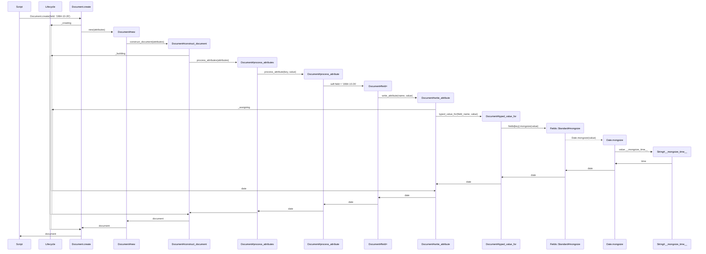

# Mongoization

"Mongoization" is the process of converting Ruby objects into a format suitable for storage in MongoDB. This process ensures that data types are correctly transformed to match MongoDB's expectations, allowing for seamless storage and retrieval.

This exploration assumes the following setup:

```ruby
class Person
  include Mongoid::Document

  field :birthdate, type: Date
end

person = Person.create(birthdate: '1985-10-26')
```

The birthdate gets mongoized from a String to a Date during the assignment process. The following sequence diagram illustrates the detailed steps involved in this mongoization process when creating a new document.


