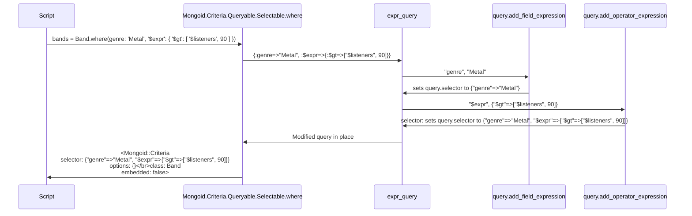
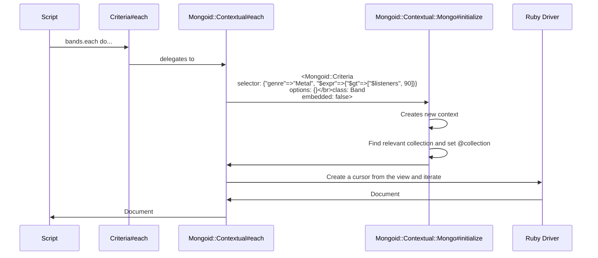
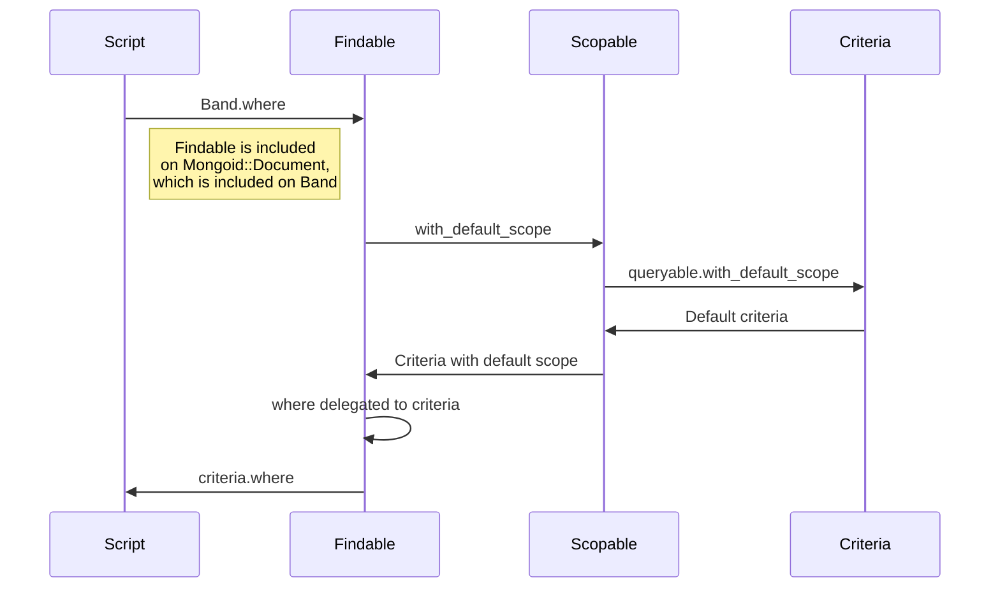
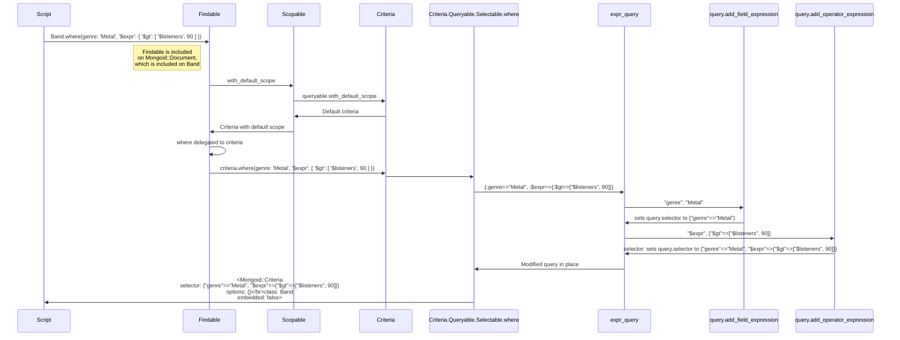

# `Mongoid::Document.where`

`where` builds query filters through lazy evaluation. When `where(filter)` is called on a model (for example, `Band`), it will be delegated to a criteria with a default scope; in other words, a criteria on Band without any filters. `Criteria.where` works by cloning itself and running `expr_query`, which parses the filters and adds them to its `selector`. The result of where is a filtered `Criteria`.

`each` is responsible for turning the `Criteria` into iterable documents. When `each` is called, it is delegated to `context.each`; this creates a context (using `Contextual::Memory` for embedded documents and `Contextual::Mongo` otherwise) from the criteria and iterates on it. Context initialization includes finding the collection associated with the calling criteria and creating a view of said collection. Iterating over a context calls `documents_for_iteration`. If documents are preloaded (ie, `@documents_loader` exists), `documents_for_iteration` will return Mongoid document instances. If the criteria is eager loadable, `documents_for_iteration` will return an array of Mongoid document instances after loading them from the view. Otherwise, `documents_for_iteration` will return a raw view. If each was called with a code block, the result of `documents_for_iteration` is passed to `yield_document` along with the block. This processes the document and yields it to the code block.

Where:



Each:



Delegation:



Basically, Findable extends Forwardable. It delegates many functions (including where) to Criteria with a default scope

Findable with Where:



How is the result mapped to Document instances?
`Factory.from_db(klass, document, criteria)`
Klass is the class that the document should turn into an object of. For example, Band.
Document is a hash of the raw document to process
Criteria is the selector used to get the document
Calls execute_from_db, which then calls:

```ruby
Instantiator.new(klass, attributes, criteria, selected_fields)
            .instance(execute_callbacks: execute_callbacks)
```

From here, a new instantiator is built, then .instance is called. In .new, Instantiator checks for attributes[klass.discriminator_key], which has information on type. This is useful if a class inherits from a base class (ex, Shape and Triangle). If an object of type Triangle is found through Shape.where(), it will be instantiated as a Triangle, and not a Shape. If no type information is found, the class used to make the query is used to instantiate.

If type.blank?, Instantiator calls instantiate_without_type, which calls klass.instantiate_document. This is the most common path. If type exists, it calls klass.instantiate_with_type, which calls constantized_type.instantiate_document. After, if the criteria states that there is an association and a parent document, set relation on the resulting object to the inverse of the association on the criteria.

Klass.instantiate_document is in document.rb. It allocates the doc, then sets `__selected_fields`, `@attributes`, and `@attributes_before_type_cast`. It uses allocate to skip instantiation because `__selected_fields`, `@attributes`, and `@attributes_before_type_cast` are from the database and default value logic, initialization callbacks, etc do not need to be re-run. Then, it handles the callbacks after instantiation.
